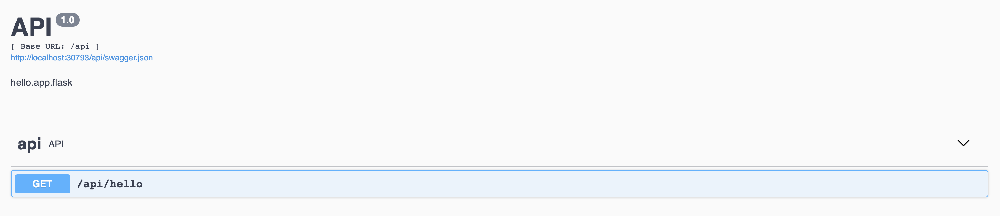

## The Flask API example used in tutorial: 

[Use Kubernetes as local development environment on Mac](https://github.com/yanfuzhou/a-flask-app/wiki/Use-Kubernetes-as-local-development-environment-on-Mac)

### For deployment:
https://github.com/yanfuzhou/a-flask-app/tree/master/deployments

### For developer:
```bash
pip install -r requirements.txt
./uwsgi.sh
```
Then open http://localhost:4000/api in a browser



To build a docker file, execute following command
```bash
docker build --rm -t a-flask-app .
```